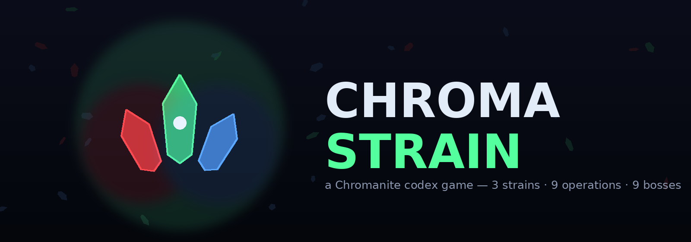
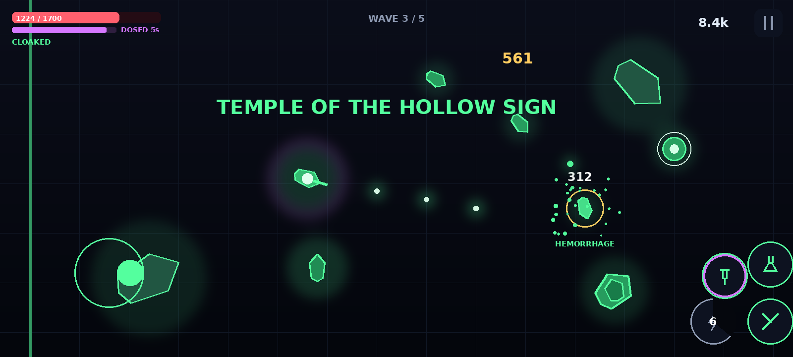
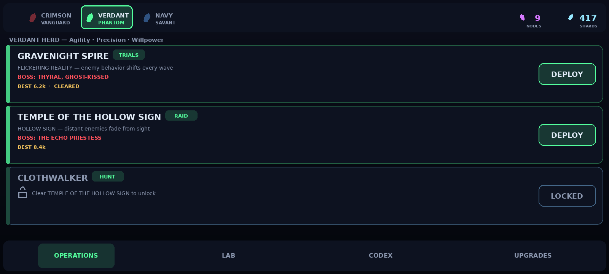

# CHROMA STRAIN



A complete, playable Android twin-stick action roguelite adapted from the design
codex **"Skills, Gadgets, Weapons and Operations"** (Chromanite universe).

Three strains, nine operations, nine bosses — every weapon passive, skill,
gadget, dose and boss gimmick implemented from the source document. Includes an
in-game Codex (the source lore) and a Cultivation Lab minigame built on the
codex's real "growth conditions" rules.

**Ready-to-install APK:** [`dist/ChromaStrain-debug.apk`](dist/ChromaStrain-debug.apk)
(signed debug build, minSdk 24 / target 34 — sideload on any Android 7.0+ phone).

| Run (Temple of the Hollow Sign) | Hub — Operations |
|---|---|
|  |  |

*Style renders generated by `scripts/gen_promo.py` with the game's exact palette and draw routines.*

## Play

- **Left half** — move (dynamic stick)
- **Right half** — aim + fire (dynamic stick)
- **Buttons** — Melee · Skill · Gadget · Dose (fills on kills)
- Pick your strain in the hub (top chips), clear TRIALS → RAID → HUNT per
  faction, harvest nodes, cultivate doses in the LAB (answers are in the CODEX),
  spend shards on UPGRADES.

## Build

### Android Studio / Gradle (standard)
Open `ChromaStrain/` in Android Studio (AGP 8.5, compileSdk 34, no
dependencies), or:

```bash
gradle -p ChromaStrain assembleDebug
```

CI does this on every push — see `.github/workflows/android-build.yml`
(APK uploaded as a build artifact).

### No-SDK pipeline (how `dist/` was built)
For environments without the Android SDK, `scripts/build_apk.py` builds and
signs the APK using aapt2 (from the Apktool jar), Robolectric's `android-all`
jar as the platform, `dx` for dexing and `uber-apk-signer` (v2+v3 signatures):

```bash
python3 ChromaStrain/scripts/build_apk.py
```

Tools are downloaded automatically into `ChromaStrain/tools/` on first run.

### Headless gameplay test
A bot plays **every operation with every faction** on the JVM (Android classes
shadowed by lightweight stubs) — all nine boss scripts are driven from spawn to
death, plus mortal-difficulty telemetry and the defeat path:

```bash
bash ChromaStrain/scripts/run_sim.sh   # expects "SIM: ALL RUNS OK"
```

### Regenerating assets
All art and audio is procedural:

```bash
pip install pillow numpy
python3 ChromaStrain/scripts/gen_icons.py   # launcher icons
python3 ChromaStrain/scripts/gen_audio.py   # 33 SFX + 5 seamless music loops
```

## Docs

Full design rationale (source-material analysis, genre/art/narrative decisions,
faction kits, boss table, economy, roadmap): [`docs/GDD.md`](docs/GDD.md) (PT-BR).

## Code map

```
app/src/main/java/com/chromastrain/game/
  MainActivity, GameView          app shell, immersive surface + fixed-step loop
  Game, Screen, Input, Sfx, Save  services: state machine, multitouch, audio, persistence
  G, Ui, Palette, Particles       toolkit: draw helpers, widgets, colors, particle pool
  Strain, Ops, CodexData          the adapted codex data (kits, operations, lore)
  World, Player, Enemy, Boss      simulation: arena/waves/zones, 3 kits, 5 archetypes, 9 bosses
  Bullet                          pooled projectiles
  TitleScreen, HubScreen,         screens: title, hub (ops/lab/codex/upgrades),
  RunScreen, ResultScreen         gameplay HUD + controls, results
```
